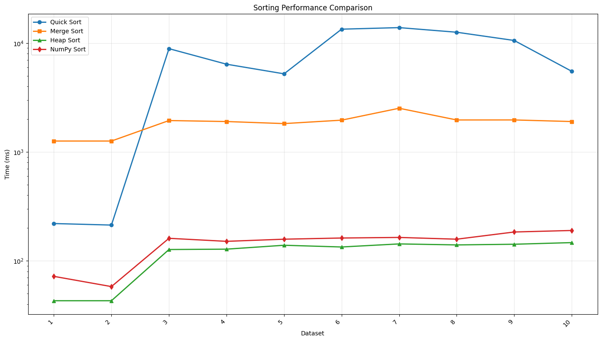

## BÁO CÁO KẾT QUẢ THỬ NGHIỆM

**Lớp:** ATTN2025  

**Sinh viên thực hiện:** Trần Anh Thi (25521742)  

**Nội dung báo cáo:** So sánh tốc độ giữa các thuật toán sort trong Python  

---

## I. Kết quả thử nghiệm

### 1. Bảng thời gian thực hiện (millisecond)

| Dữ liệu | Quicksort (ms) | Heapsort (ms) | Mergesort (ms) | sort (NumPy) (ms) |
|--------:|---------------:|--------------:|---------------:|------------------:|
| 1 | 72  | 220   | 1259 | 43  |
| 2 | 58  | 213   | 1259 | 43  |
| 3 | 161 | 8882  | 1942 | 127 |
| 4 | 151 | 6393  | 1902 | 128 |
| 5 | 158 | 5215  | 1821 | 139 |
| 6 | 162 | 13411 | 1958 | 134 |
| 7 | 164 | 13858 | 2519 | 143 |
| 8 | 158 | 12569 | 1966 | 140 |
| 9 | 184 | 10558 | 1967 | 142 |
| 10 | 190 | 5501 | 1902 | 147 |
| **Trung bình** | **145.8** | **7682.0** | **1849.5** | **118.6** |

---

### 2. Biểu đồ (cột) thời gian thực hiện

*(Biểu đồ được xây dựng từ bảng dữ liệu trên)*  

## II. Kết luận:

1. Ta nhận thấy Numpy có tốc độ nhanh nhất bởi vì NumPy nhanh vì tính toán bằng C (không loop Python), dữ liệu liên tục trong RAM, tận dụng SIMD/cache CPU và dùng thư viện tối ưu như BLAS/LAPACK; sort mặc định là Quicksort (có Mergesort/Heapsort).

2. Quicksort có độ ổn định khá là tốt và dùng như gần bằng Numpy trong bộ dữ liệu này tuy nhiên nó vẫn chậm hơn Numpy.

3. Merge Sort cũng là kiểu sort có độ ổn định khá tốt tuy nhiên nó dường như chậm hơn rất nhiều so với Numpy và QuickSort bởi cài đặt chịu nhiều tác dụng của Recursion Depth.

4. Heap Sort là kiểu sort bất ổn định nhất ở vài dataset đầu thì nó còn nhanh hơn cả Merge Sort nhưng về sau thì nó lại cực kì chậm, nguyên nhân có thể là do Max Heap ở dataset đã được sắp xếp ít lần cần thao tác hơn.

Chung quy lại về tốc độ trung bình $Numpy < QuickSort < Merge Sort < Heap Sort$ khi xét trên bộ dữ liệu này.

Thêm một nhận xét nữa là những thuật toán ổn định trên các bộ dữ liệu sẽ ổn định tiếp với đa số mọi bộ dữ liệu, còn HeapSort bất ổn định nên chúng ta có thể tìm một trường hợp nào đó giúp nó chạy siêu nhanh.

---

## III. Thông tin chi tiết – link github, trong repo github cần có

Link github repo: https://github.com/RyouLegacy/SortingAlgorithm.git  

Dữ liệu thử nghiệm được sinh random trong file testcase.py
